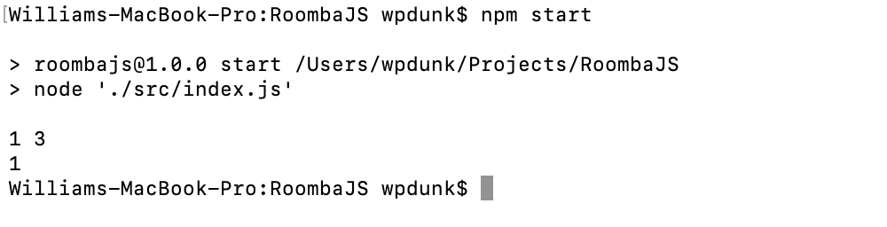
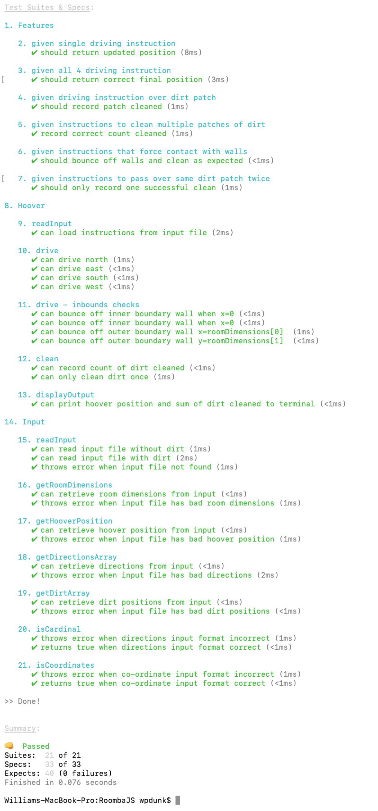

# RoombaJS

**Tech Test Submission: William Dunk**

A program that navigates a imaginary robotic hoover (much like a Roomba) through an equally imaginary room.

## Getting Started

### Requirements

Ensure you have [**Node**](https://nodejs.org/en/) installed on your machine. If running macOS use [**HomeBrew**](https://brew.sh/) to install Node run `brew install node` in your terminal.

### Setup

Clone repo: `git clone https://github.com/wpdunk/RoombaJS.git`

Install dependencies: `npm install`

### Usage

To **Run** the application: `npm start`

To **Test** the application: `npm test`

### Screenshots

Successful execution.



Successful tests.



## Development Documentation

### Approach

- Built the program from the outside in.
- Lead with feature, then unit tests.
- Began with single class Hoover.
- Introduced second class Input.
  - To manage reading and interpretation of the input file.
- Used dependancy injection to optimise loose coupling.
- Mocked dependencies in unit tests.
- TDD throughout.

### User Stories

```
As a hoover operator,
I want to be able to map the room,
So that dirt and hoover locations can be tracked.
```

```
As a hoover operator,
I want to be able to record locations of dirt,
So that they can be processed.
```

```
As a hoover operator,
I want to be able to define the initial location of the hoover,
So that it can be driven accurately.
```

```
As a hoover operator,
I want to be able to process hoover driving instructions,
So that the room can be cleaned.
```

```
As a hoover operator,
I want to be notified of the number of dirt patches cleaned.
So that I know if the operation was successful or not.
```

```
As a hoover operator,
I want to be notified with the final hoover position.
So that I can identify successful navigation.
```
